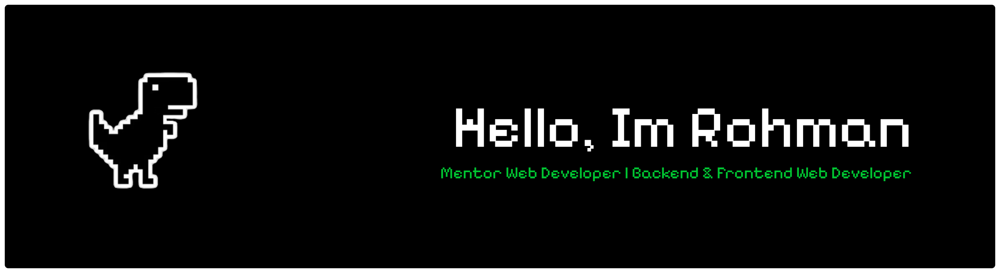

  

<h1 align="center">Hi 👋, I'm Rohman</h1>

  

  

---

## About Me

Saya adalah seorang **Fullstack Web Developer** dan **Mentor** yang berdedikasi untuk menjembatani celah antara kode yang sekadar "jalan" dengan kode yang "berkualitas".

- 🚀 **Scalability:** Membangun sistem yang siap tumbuh bersama user.
- 🧠 **Mentorship:** Membantu developer muda menguasai struktur backend yang **Clean & SOLID**.
- ⚡ **Performance:** Optimasi sistem real-time dan arsitektur database.
- 🏗️ **Architect:** Merancang sistem yang maintainable untuk jangka panjang.

---

## 🛠 My Tech Universe

### 🌐 Frontend & Core Languages

  
  
  
  
  
  

### ⚙️ Backend & Frameworks

  
  
  

### 🗄️ Database & Environment

  
  
  
  
  
  
  

### 🎨 Design & Collaborative Tools

  
  
  
  
  

### 🤖 AI & Productivity

  
  
  
  
  
  
  

---

## 📈 Engineering Stats

  
  

  

---

## 🎓 Mentoring Philosophy
> *"Bukan cuma soal baris kode, tapi soal bagaimana cara berpikir logis dan sistematis."*
> Saya percaya bahwa best practice seperti **DRY**, **KISS**, dan **SOLID** adalah investasi terbaik bagi setiap developer.

---

## 📫 Let's Collaborate!

  
  
  

  

